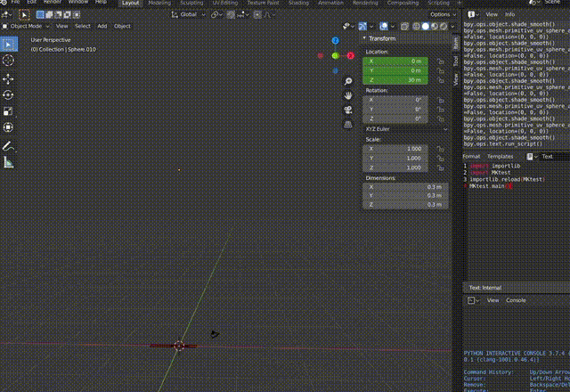

# blender_mod
Yay, blender tutorial by [Blender Guru](https://www.youtube.com/channel/UCOKHwx1VCdgnxwbjyb9Iu1g) completed, waiting for more lessons!
Latest result: [Image](https://github.com/Meao/blender_mod/blob/master/cupnd.jpg)

MKtest.py is a tryout to create an animated histogram with fireworks using bpy 

